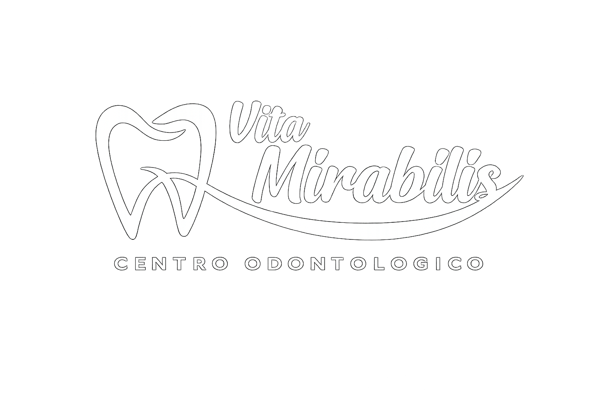
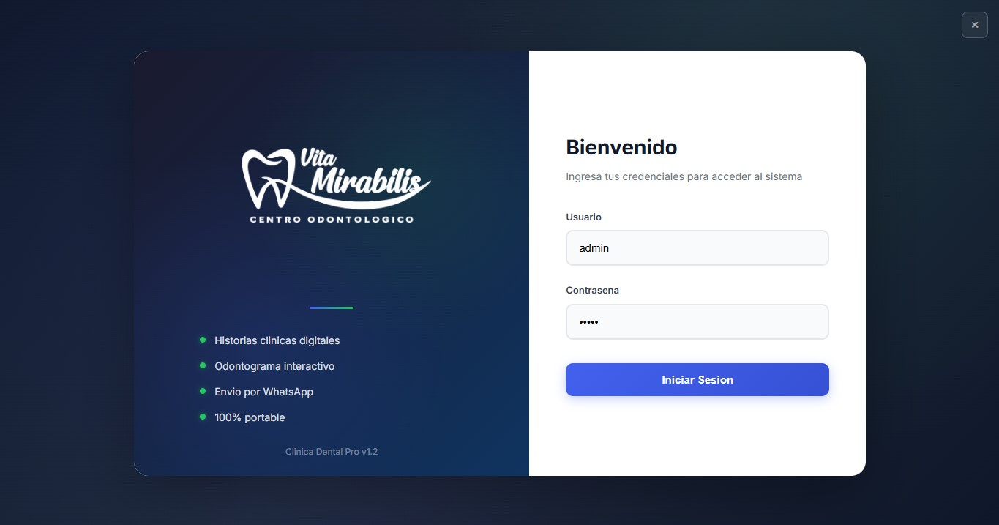
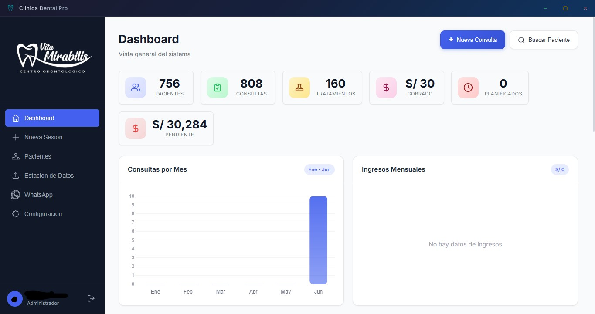

<div align="center">



# Clinica Dental Pro

### Sistema de Historial Clinico Odontologico para Escritorio

[](./LICENSE)
[](./CHANGELOG.md)
[](https://www.electronjs.org/)
[](https://nodejs.org/)
[](https://www.sqlite.org/)
[](https://react.dev/)

---

**Gestiona historiales clinicos, odontogramas, tratamientos, pagos, recetas y mas - todo desde una sola interfaz, sin internet.**

[ Descargar Instalador ](https://github.com/Charles-X-Core/odontologia-sistema/releases/tag/v1.2.0) | [ Ver Documentacion ](documentacion/00-RESUMEN.md) | [ Guia de Desarrollo ](documentacion/GUIA_DESARROLLO.md)

---

</div>

## Sobre el Proyecto

Clinica Dental Pro es una aplicacion de escritorio para Windows disenada para clinicas odontologicas pequenas y medianas. Permite gestionar historiales clinicos, odontogramas interactivos, tratamientos, pagos, recetas medicas y comunicacion con pacientes via WhatsApp - todo desde una sola interfaz.

El sistema funciona completamente **offline**, sin necesidad de conexion a internet, y se distribuye como un **instalador automatico** o **version portable**.

---

## Capturas de Pantalla

<div align="center">

<table>
<tr>
<td align="center"><strong>Login</strong></td>
<td align="center"><strong>Dashboard</strong></td>
</tr>
<tr>
<td></td>
<td></td>
</tr>
</table>

</div>

---

## Por Que "Clinica Dental Pro"?

El proyecto fue originalmente desarrollado bajo el nombre "Vita Mirabilis". Sin embargo, se descubrio que **"Vita Mirabilis" es una marca registrada perteneciente a un tercero**. Para evitar conflictos legales y respetar la propiedad intelectual, el proyecto fue renombrado a **"Clinica Dental Pro"** - un nombre descriptivo que refleja claramente la naturaleza del sistema.

---

## Para Quien Fue Dirigido

| Publico | Razon |
|---------|-------|
| **Clinicas pequenas/medianas** | Solucion sin costo de licencia |
| **Doctores independientes** | Gestion digital de pacientes |
| **Estudiantes de odontologia** | Sistema de practica |
| **Equipos medicos** | Alternativa accesible a sistemas comerciales |

---

## Por Que Es Importante

- **Eficiencia**: Reduce tiempo administrativo vs. sistemas en papel
- **Precision**: Minimiza errores en diagnostico y tratamiento
- **Comunicacion**: Envia recetas y planes directamente por WhatsApp
- **Seguridad**: Firma digital del doctor en todos los documentos
- **Accesibilidad**: Funciona sin internet, sin cuotas mensuales

---

## Verificado por Experto

<div align="center">

> Este sistema fue **disenado y verificado en conjunto con un doctor odontologo aprobado**, asegurando que:
>
> - El odontograma cumple la **norma FDI (ISO 3950)** con 32 piezas permanentes y 20 temporales
> - Los campos clinicos son los requeridos por la legislacion sanitaria vigente
> - El flujo del wizard de 8 pasos es practico y eficiente
> - Los PDFs generados cumplen con los formatos estandar del sector
> - La validacion de documentos (DNI, CE, Pasaporte) sigue las tablas SUNAT

</div>

---

## Caracteristicas Principales

<table>
<tr>
<td width="50%">

**Modulos Clinicos**

- **Pacientes** - CRUD completo con busqueda inteligente
- **Historias Clinicas** - N HCL unico, antecedentes (11 campos)
- **Sesion Clinica** - Wizard de 8 pasos
- **Odontograma** - SVG interactivo, 52 piezas, colores por estado
- **Tratamientos** - Plan con costos, estados, abonos
- **Pagos** - Registro con comprobantes PDF
- **Recetas** - Medicamentos con dosis y frecuencia

</td>
<td width="50%">

**Funcionalidades**

- **Evidencias** - Fotos via drag-and-drop, QR, WhatsApp
- **WhatsApp** - Mensajes y PDFs, anti-ban (20 msgs/hora)
- **Firma Digital** - 3 modos: dibujar, imagen, celular
- **Dashboard** - 4 graficos + 6 stat cards
- **Paciente 360** - Vista completa del paciente
- **PDFs** - Historia clinica, recetas, tratamientos, pagos
- **Backup** - Excel/CSV + backup SQLite completo

</td>
</tr>
</table>

---

## Instalacion Rapida

### Opcion 1: Portable (Recomendado)

1. **Descargar** [`Clinica Dental Pro 1.2.0.exe`](https://github.com/Charles-X-Core/odontologia-sistema/releases/tag/v1.2.0)
2. **Ejecutar** el archivo
3. **Seleccionar** carpeta de destino
4. **Listo** - el icono aparece en el escritorio

### Opcion 2: Desarrollo

```bash
# Clonar repositorio
git clone https://github.com/Charles-X-Core/odontologia-sistema.git
cd odontologia-sistema

# Instalar dependencias
npm run install:all

# Cargar datos de prueba
npm run seed

# Ejecutar (3 terminales)
cd backend && npm run dev     # Terminal 1
cd frontend && npm run dev    # Terminal 2
npm start                     # Terminal 3
```

### Credenciales de Prueba

| Usuario | Contrasena | Rol |
|---------|-----------|-----|
| `admin` | `admin` | Administrador |
| `doctor` | `doctor` | Odontologo |

---

## Requisitos del Sistema

| Requisito | Minimo |
|-----------|--------|
| **Sistema Operativo** | Windows 10/11 (64-bit) |
| **RAM** | 4 GB |
| **Disco** | 500 MB |
| **Chrome** | Necesario para WhatsApp (se instala automaticamente) |

---

## Stack Tecnico

```
┌─────────────────────────────────────────────────────────┐
│                    CLINICA DENTAL PRO                    │
├─────────────────────────────────────────────────────────┤
│                                                         │
│  ┌─────────────┐  ┌─────────────┐  ┌─────────────┐    │
│  │   Frontend   │  │   Backend   │  │  Desktop    │    │
│  │  React 19    │  │  Node.js 22 │  │ Electron 35 │    │
│  │  Vite 8      │  │  Express    │  │             │    │
│  │  Chart.js    │  │  SQLite 3   │  │             │    │
│  └─────────────┘  └─────────────┘  └─────────────┘    │
│                                                         │
│  ┌─────────────────────────────────────────────────┐   │
│  │              Integraciones                       │   │
│  │  WhatsApp (whatsapp-web.js) │ PDFs (pdfmake)    │   │
│  │  Firma Digital │ Evidencias │ Backup            │   │
│  └─────────────────────────────────────────────────┘   │
│                                                         │
└─────────────────────────────────────────────────────────┘
```

| Componente | Tecnologia |
|------------|-----------|
| Frontend | React 19 + Vite 8 + Chart.js |
| Backend | Node.js 22+ + Express |
| Base de datos | SQLite (node:sqlite) |
| Desktop | Electron 35 |
| PDF | pdfmake + puppeteer-core |
| WhatsApp | whatsapp-web.js 1.34.7 |
| Build | electron-builder 26 |
| Auth | JWT + bcryptjs |

---

## Documentacion

| Archivo | Contenido |
|---------|-----------|
| [00-RESUMEN.md](documentacion/00-RESUMEN.md) | Vista general del sistema |
| [01-NORMA-ODONTOGRAMA.md](documentacion/01-NORMA-ODONTOGRAMA.md) | Norma tecnica FDI |
| [02-ESTRUCTURA-PROYECTO.md](documentacion/02-ESTRUCTURA-PROYECTO.md) | Arquitectura y carpetas |
| [03-API-ENDPOINTS.md](documentacion/03-API-ENDPOINTS.md) | Documentacion de endpoints |
| [04-MODELO-DATOS.md](documentacion/04-MODELO-DATOS.md) | Schema de base de datos |
| [05-INSTALACION.md](documentacion/05-INSTALACION.md) | Guia de instalacion |
| [06-ELECTRON.md](documentacion/06-ELECTRON.md) | Configuracion de Electron |
| [ARQUITECTURA.md](documentacion/ARQUITECTURA.md) | Diagrama de arquitectura |
| [GUIA_DESARROLLO.md](documentacion/GUIA_DESARROLLO.md) | Guia para desarrolladores |
| [SOLUCION_PROBLEMAS.md](documentacion/SOLUCION_PROBLEMAS.md) | Troubleshooting |
| [WIZARD_SESION_CLINICA.md](documentacion/WIZARD_SESION_CLINICA.md) | Documentacion del wizard |

---

## Roadmap

### Completado

- [x] Autenticacion JWT con sesion persistente
- [x] CRUD completo de pacientes
- [x] Historias clinicas inmutables
- [x] Odontograma interactivo (SVG, 52 piezas)
- [x] Sesion clinica wizard de 8 pasos
- [x] Tratamientos con estados y costos
- [x] Pagos con comprobantes PDF
- [x] Recetas medicas con PDF
- [x] WhatsApp envio de mensajes y PDFs
- [x] Firma digital del doctor
- [x] Dashboard con graficos
- [x] Paciente 360
- [x] Busqueda inteligente multi-palabra
- [x] Instalador NSIS con dependencias automaticas
- [x] Version portable
- [x] Rebranding a Clinica Dental Pro

### Pendiente

- [ ] Calendario de citas
- [ ] Reportes (mensual ingresos, tratamientos comunes)
- [ ] Multi-usuario real con roles granulares
- [ ] Audit log
- [ ] Tema oscuro

---

## Contribuir

Ver [CONTRIBUTING.md](CONTRIBUTING.md) para guias de contribucion.

---

## Problemas Conocidos

| Problema | Solucion |
|----------|----------|
| WhatsApp QR loop | Chrome 149 tiene bugs, se fuerza Chrome 146 |
| QR solo funciona en misma red | Telefono y PC deben estar en la misma red local |
| Windows Defender marca el portable | Es normal para apps Electron no firmadas |

---

## Licencia

MIT License - Ver [LICENSE](LICENSE)

---

## Creditos

<div align="center">

**Desarrollo**: Charles-X RedFlame Systems

**Verificacion clinica**: Doctor odontologo aprobado

**Tecnologias**: [Electron](https://www.electronjs.org/) | [React](https://react.dev/) | [Node.js](https://nodejs.org/) | [SQLite](https://www.sqlite.org/) | [whatsapp-web.js](https://wwebjs.dev/) | [pdfmake](http://pdfmake.org/)

---

**Clinica Dental Pro** - Sistema de Historial Clinico Odontologico

*Desarrollado con dedicacion para la comunidad odontologica*

</div>
